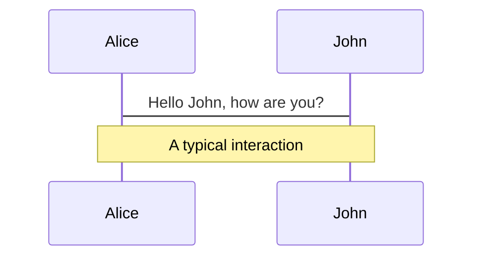
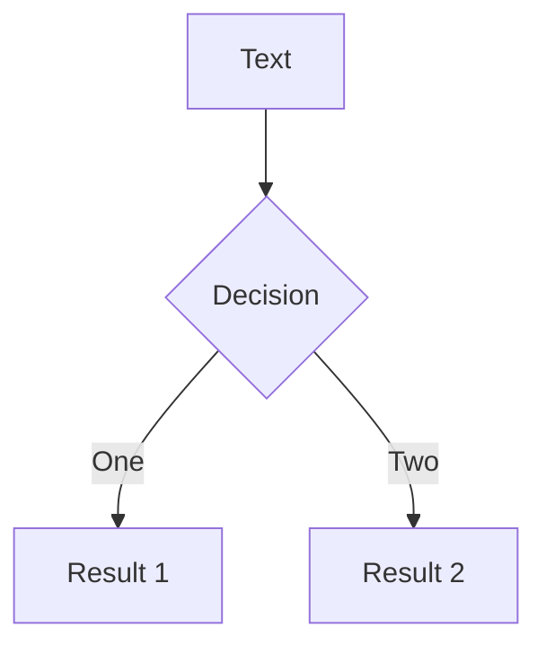
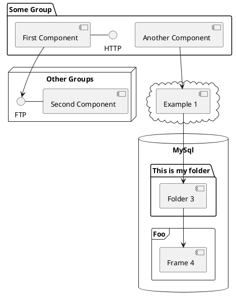

---
# try also 'default' to start simple
theme: seriph
# random image from a curated Unsplash collection by Anthony
# like them? see https://unsplash.com/collections/94734566/slidev
background: https://source.unsplash.com/collection/94734566/1920x1080
# apply any windi css classes to the current slide
class: 'text-center'
# https://sli.dev/custom/highlighters.html
highlighter: shiki
# show line numbers in code blocks
lineNumbers: false
# some information about the slides, markdown enabled
info: |
  ## Slidev Starter Template
  Presentation slides for developers.

  Learn more at [Sli.dev](https://sli.dev)
# persist drawings in exports and build
drawings:
  persist: false
# use UnoCSS (experimental)
css: unocss
---

# How I got 1600 stars on GitHub in 2 months of Open Source work


<div class="pt-13 relative">
  <div class="absolute px-2 py-1 rounded cursor-pointer right-0" hover="bg-white bg-opacity-10">
    <div>https://twitter.com/hung_dev</div>
     <div>https://github.com/nvh95</div>
  </div>
</div>

<!-- TODO: Add jest preview logo and QR code -->

<style>
  .slidev-layout.cover h1, .slidev-layout.intro h1 {
    font-size: 2.5rem;
  }
</style>

<!--
The last comment block of each slide will be treated as slide notes. It will be visible and editable in Presenter Mode along with the slide. [Read more in the docs](https://sli.dev/guide/syntax.html#notes)
-->

---

# Hi, My name is Hung 👋
<!-- TODO: Profile image in the right (use layout) -->

- Full-time Open Source contributor
- Creator of <a href="https://github.com/nvh95/jest-preview">Jest Preview</a>
- Core member of <a href="https://www.bestofjs.org">bestofjs.org</a>
- Ex - Lead Frontend Engineer @ Got It Inc.
- Obsession with DX
- Connect with me:
  - <carbon-logo-twitter />: <a href="https://twitter.com/hung_dev" target="_blank">@hung_dev</a>
  - <carbon-logo-github />: <a href="https://github.com/nvh95" target="_blank">@nvh95</a>
  - 🔗: <a href="https://hung.dev" target="_blank">hung.dev</a>
<!-- QR Code -->

---

# Table of Contents
- What is Jest Preview and why I build it?
- Struggles?
- What did I got from doing open source software?
- Open Source Advice
- Are you ready to start your open source journey?
  - Star Jest Preview (QR code)
- Q&A

--- 

#  How I got 1600 stars on GitHub in 2 months of Open Source work

- Why I decided to quit my full-time job to do open source full-time?
- How to choose the open source project to work on?
- How to create your own project to work on?
- What struggles an open source software maintainers have to deal with, but people don't know about (stress, financial...)?
- Instead of being an engineer in a company, an author of an open source software project has to play many roles: engineers, testers, PM, designers, marketing...
- How to manage time efficiently as a full time open source contributor>
- What should we do when our project gets attention from people around the world?
- Advice/ Encourage everyone to start working on an open source project.


---

# How to choose a open source project to work on?

- Must be the project you use everyday
  - tweet: Use it
  - react-..., vscode extensions,...

--- 

# Struggles

- Difficult.

```js 
import styles from './styles.module.css';

<div className={styles.button}>Click me</div>
```
E.g: We might know how to use CSS Modules, but we might not need to know how CSS Modules work under the hood

<v-click>
```js
require('postcss-modules')({
    getJSON: (cssFileName, json, outputFileName) => {
      console.log(JSON.stringify(json));
    },
    generateScopedName: function (name, filename, css) {
      const stringHash = require('string-hash');
      const i = css.indexOf('.' + name);
      const line = css.substr(0, i).split(/[\\r\\n|\\n|\\r]/).length;
      const removedNewLineCharactersCss = css.replace(/(\\r\\n|\\n|\\r)/g, '');
      const hash = stringHash(removedNewLineCharactersCss).toString(36).substr(0, 5);
      return '_' + name + '_' + hash + '_' + line;
    },
  })
```
</v-click>

---

# Struggles

- Time
- To add an image to the right

---

# Struggles

- Since it's an open source project, many people will come to help you
- Not true
- Alone
- Sometimes you want to give up/ archive the project

---

# Struggles

- Financially 💸
- GitHub Sponsors
- Open Collective

---

# What did I got from doing open source software?

<v-click>

- Knowledge. Lot of knowledge.

</v-click>

<v-click>

- Read open source code a lot => work with new project/ debugging skills improved

</v-click>

<v-click>

- Understand how your tools you use everyday work => Better programmer

</v-click>

<v-click>

- Rabbit hole: Jest, Vite core, CRA core, Websocket, chokidar, shebang, PostCSS, Babel...

</v-click>

---

# What did I got from doing open source software?


Opportunities:


<v-click>

- Nominated for the Most Exciting Use of Technology, React Open Source Awards, React Summit
<!-- TODO: Insert image has all nominees -->
</v-click>

<v-click>

- Jobs: Companies reach out

</v-click>

<v-click>

- Conferences/ Tech events
<!-- Insert image -->

</v-click>

--- 

# What did I got from doing open source software?


Network:


- Twitter
<div class="flex gap-1 m-b-2">


</div>
<div class="flex gap-1 m-b-2">


</div>


---

# What did I got from doing open source software?


Network:


- In-person
- Maya
- Tan Li Hau
- Evan You

---

# What did I got from doing open source software?


People thanked me:

To add some thank you note

=> Motivation for me to keep doing it

<!-- 9-5 -->


---

# So...

Contribute to Open Source today.

<v-click>

How to do that?

</v-click>
---
layout: center
class: text-center
---

# Open Source Advice

---

# How to choose a open source project to work on?


---

# Find a maintainer


---

# Do not start at 1.x


---

# Use your own software


---

# Ask for feedback

---

# Learn from others


---

# Write good Documentations

- https://www.jest-preview.com
- https://docusaurus.io
- https://vitepress.vuejs.org
---

# Marketing/ Advertising

- Twitter
- Blog Posts
- Tech events

---

# What is Slidev?

Slidev is a slides maker and presenter designed for developers, consist of the following features

- 📝 **Text-based** - focus on the content with Markdown, and then style them later
- 🎨 **Themable** - theme can be shared and used with npm packages
- 🧑‍💻 **Developer Friendly** - code highlighting, live coding with autocompletion
- 🤹 **Interactive** - embedding Vue components to enhance your expressions
- 🎥 **Recording** - built-in recording and camera view
- 📤 **Portable** - export into PDF, PNGs, or even a hostable SPA
- 🛠 **Hackable** - anything possible on a webpage

<br>
<br>

Read more about [Why Slidev?](https://sli.dev/guide/why)

<!--
You can have `style` tag in markdown to override the style for the current page.
Learn more: https://sli.dev/guide/syntax#embedded-styles
-->

<style>
h1 {
  background-color: #2B90B6;
  background-image: linear-gradient(45deg, #4EC5D4 10%, #146b8c 20%);
  background-size: 100%;
  -webkit-background-clip: text;
  -moz-background-clip: text;
  -webkit-text-fill-color: transparent;
  -moz-text-fill-color: transparent;
}
</style>

---

# Navigation

Hover on the bottom-left corner to see the navigation's controls panel, [learn more](https://sli.dev/guide/navigation.html)

### Keyboard Shortcuts

|     |     |
| --- | --- |
| <kbd>right</kbd> / <kbd>space</kbd>| next animation or slide |
| <kbd>left</kbd>  / <kbd>shift</kbd><kbd>space</kbd> | previous animation or slide |
| <kbd>up</kbd> | previous slide |
| <kbd>down</kbd> | next slide |

<!-- https://sli.dev/guide/animations.html#click-animations -->

<p v-after class="absolute bottom-23 left-45 opacity-30 transform -rotate-10">Here!</p>

---
layout: image-right
image: https://source.unsplash.com/collection/94734566/1920x1080
---

# Code

Use code snippets and get the highlighting directly![^1]

```ts {all|2|1-6|9|all}
interface User {
  id: number
  firstName: string
  lastName: string
  role: string
}

function updateUser(id: number, update: User) {
  const user = getUser(id)
  const newUser = { ...user, ...update }
  saveUser(id, newUser)
}
```

<arrow v-click="3" x1="400" y1="420" x2="230" y2="330" color="#564" width="3" arrowSize="1" />

[^1]: [Learn More](https://sli.dev/guide/syntax.html#line-highlighting)

<style>
.footnotes-sep {
  @apply mt-20 opacity-10;
}
.footnotes {
  @apply text-sm opacity-75;
}
.footnote-backref {
  display: none;
}
</style>

---

# Components

<div grid="~ cols-2 gap-4">
<div>

You can use Vue components directly inside your slides.

We have provided a few built-in components like `<Tweet/>` and `<Youtube/>` that you can use directly. And adding your custom components is also super easy.

```html
<Counter :count="10" />
```

<!-- ./components/Counter.vue -->
<Counter :count="10" m="t-4" />

Check out [the guides](https://sli.dev/builtin/components.html) for more.

</div>
<div>

```html
<Tweet id="1390115482657726468" />
```

<Tweet id="1390115482657726468" scale="0.65" />

</div>
</div>


---
class: px-20
---

# Themes

Slidev comes with powerful theming support. Themes can provide styles, layouts, components, or even configurations for tools. Switching between themes by just **one edit** in your frontmatter:

<div grid="~ cols-2 gap-2" m="-t-2">

```yaml
---
theme: default
---
```

```yaml
---
theme: seriph
---
```


</div>

Read more about [How to use a theme](https://sli.dev/themes/use.html) and
check out the [Awesome Themes Gallery](https://sli.dev/themes/gallery.html).

---
preload: false
---

# Animations

Animations are powered by [@vueuse/motion](https://motion.vueuse.org/).

```html
<div
  v-motion
  :initial="{ x: -80 }"
  :enter="{ x: 0 }">
  Slidev
</div>
```

<div class="w-60 relative mt-6">
  <div class="relative w-40 h-40">
    
    
    
  </div>

  <div
    class="text-5xl absolute top-14 left-40 text-[#2B90B6] -z-1"
    v-motion
    :initial="{ x: -80, opacity: 0}"
    :enter="{ x: 0, opacity: 1, transition: { delay: 2000, duration: 1000 } }">
    Slidev
  </div>
</div>

<!-- vue script setup scripts can be directly used in markdown, and will only affects current page -->
<script setup lang="ts">
const final = {
  x: 0,
  y: 0,
  rotate: 0,
  scale: 1,
  transition: {
    type: 'spring',
    damping: 10,
    stiffness: 20,
    mass: 2
  }
}
</script>

<div
  v-motion
  :initial="{ x:35, y: 40, opacity: 0}"
  :enter="{ y: 0, opacity: 1, transition: { delay: 3500 } }">

[Learn More](https://sli.dev/guide/animations.html#motion)

</div>

---

# LaTeX

LaTeX is supported out-of-box powered by [KaTeX](https://katex.org/).

<br>

Inline $\sqrt{3x-1}+(1+x)^2$

Block
$$
\begin{array}{c}

\nabla \times \vec{\mathbf{B}} -\, \frac1c\, \frac{\partial\vec{\mathbf{E}}}{\partial t} &
= \frac{4\pi}{c}\vec{\mathbf{j}}    \nabla \cdot \vec{\mathbf{E}} & = 4 \pi \rho \\

\nabla \times \vec{\mathbf{E}}\, +\, \frac1c\, \frac{\partial\vec{\mathbf{B}}}{\partial t} & = \vec{\mathbf{0}} \\

\nabla \cdot \vec{\mathbf{B}} & = 0

\end{array}
$$

<br>

[Learn more](https://sli.dev/guide/syntax#latex)

---

# Diagrams

You can create diagrams / graphs from textual descriptions, directly in your Markdown.

<div class="grid grid-cols-3 gap-10 pt-4 -mb-6">







</div>

[Learn More](https://sli.dev/guide/syntax.html#diagrams)


---
layout: center
class: text-center
---

# Learn More

[Documentations](https://sli.dev) · [GitHub](https://github.com/slidevjs/slidev) · [Showcases](https://sli.dev/showcases.html)
